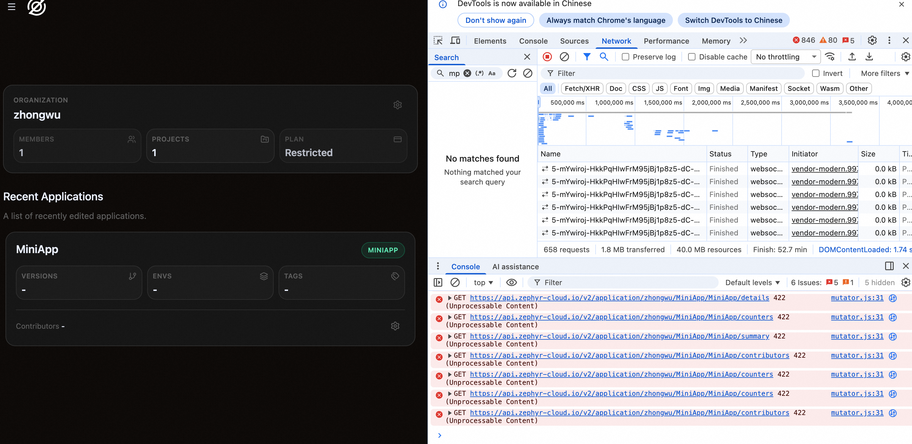

* Another error:  Fixed by execute `yarn add zephyr-xpack-internal`
```
error Unknown error: {"code":"MODULE_NOT_FOUND","requireStack":["/Users/zhongwu/Documents/workspace/zephyr/MiniApp/node_modules/zephyr-metro-plugin/dist/lib/internal/mutate-mf-config.js","/Users/zhongwu/Documents/workspace/zephyr/MiniApp/node_modules/zephyr-metro-plugin/dist/lib/zephyr-metro-plugin.js","/Users/zhongwu/Documents/workspace/zephyr/MiniApp/node_modules/zephyr-metro-plugin/dist/lib/zephyr-metro-command-wrapper.js"]}.
Error: Unknown error: {"code":"MODULE_NOT_FOUND","requireStack":["/Users/zhongwu/Documents/workspace/zephyr/MiniApp/node_modules/zephyr-metro-plugin/dist/lib/internal/mutate-mf-config.js","/Users/zhongwu/Documents/workspace/zephyr/MiniApp/node_modules/zephyr-metro-plugin/dist/lib/zephyr-metro-plugin.js","/Users/zhongwu/Documents/workspace/zephyr/MiniApp/node_modules/zephyr-metro-plugin/dist/lib/zephyr-metro-command-wrapper.js"]}
    at /Users/zhongwu/Documents/workspace/zephyr/MiniApp/node_modules/zephyr-metro-plugin/dist/lib/zephyr-metro-command-wrapper.js:36:19
    at async Command.handleAction (/Users/zhongwu/Documents/workspace/zephyr/MiniApp/node_modules/@react-native-community/cli/build/index.js:139:9)
```

* Documentation Issue: Metro configuration for host unclear about port requirement

In the [Configure Metro for the Host](https://docs.zephyr-cloud.io/tutorials/metro#step-1-configure-metro-for-the-host) section, the example for configuring remote address uses `localhost:8082`, but it doesn't clearly specify that the MiniApp project must be started on port 8082. This requirement may be explicitly stated in the documentation to avoid confusion.

* Documentation Issue: watchFolders configuration is not generic

In both [Configure Metro for Module Federation](https://docs.zephyr-cloud.io/tutorials/metro#step-1-configure-metro-for-module-federation) and [Configure Metro for the Host](https://docs.zephyr-cloud.io/tutorials/metro#step-1-configure-metro-for-the-host) sections, the `watchFolders` configuration includes:
```javascript
path.resolve(__dirname, '../../node_modules'),
path.resolve(__dirname, '../../packages/core')
```
This configuration is not generic and may cause errors for users with different project structures. The documentation should clarify that these paths need to be adjusted based on the actual project structure, or provide a more universal configuration example.

* Configuration Issue: Unable to configure versions/tags/envs

Unable to configure versions/tags/envs, results in errors.


