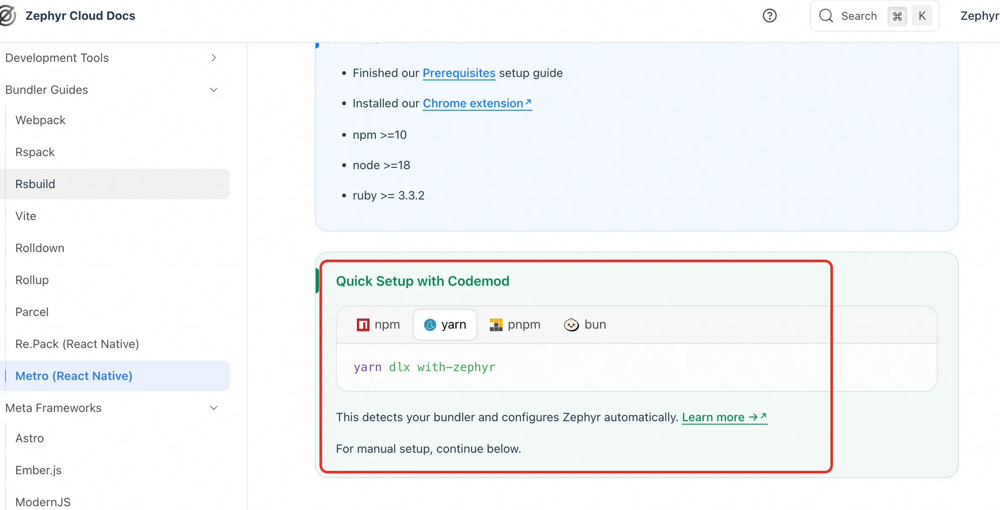
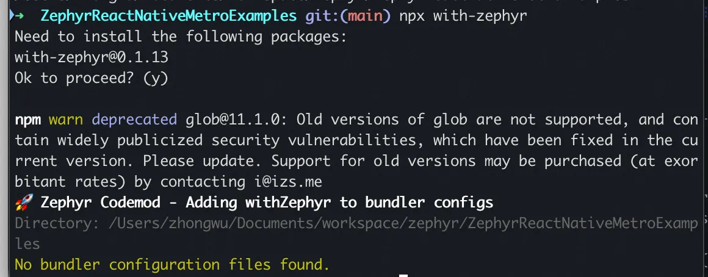
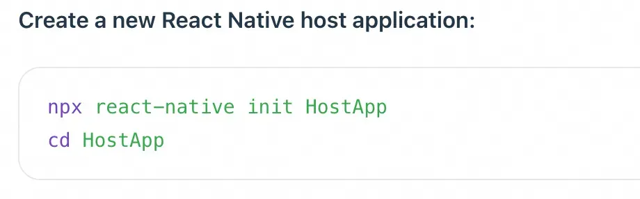
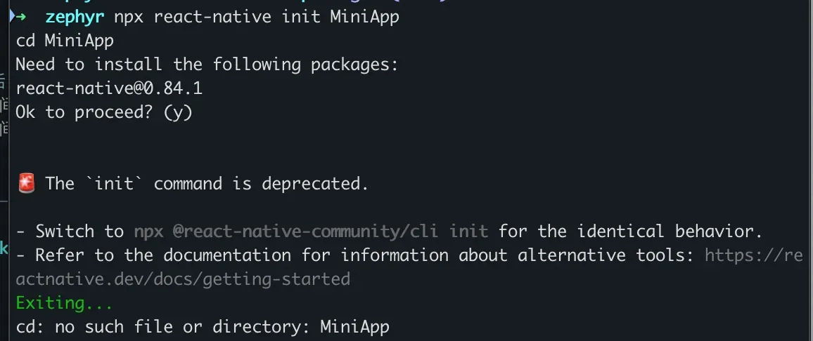

* with-zephyr does not support metro's codemod, but the tutorial shows it as supported:


* https://docs.zephyr-cloud.io/tutorials/metro, react-native cli moved to react-native-community/cli, like npx @react-native-community/cli@latest init MiniApp


* Error when bundle mini application: 
  ○ I don't see zephyrCommandWrapper exported: https://github.com/ZephyrCloudIO/zephyr-packages/blob/main/libs/zephyr-metro-plugin/src/index.ts
`npx react-native bundle-mf-remote --platform ios --dev false`
error Failed to load configuration of your project.

```
TypeError: zephyrCommandWrapper is not a function
    at Object.<anonymous> (/Users/zhongwu/Documents/workspace/zephyr/MiniApp/react-native.config.js:6:28)
    at Module._compile (node:internal/modules/cjs/loader:1554:14)
    at Object..js (node:internal/modules/cjs/loader:1706:10)
    at Module.load (node:internal/modules/cjs/loader:1289:32)
    at Function._load (node:internal/modules/cjs/loader:1108:12)
    at TracingChannel.traceSync (node:diagnostics_channel:322:14)
    at wrapModuleLoad (node:internal/modules/cjs/loader:220:24)
    at Module.require (node:internal/modules/cjs/loader:1311:12)
    at module.exports (/Users/zhongwu/Documents/workspace/zephyr/MiniApp/node_modules/import-fresh/index.js:33:91)
    at loadJsSync (/Users/zhongwu/Documents/workspace/zephyr/MiniApp/node_modules/cosmiconfig/dist/loaders.js:18:12)
```