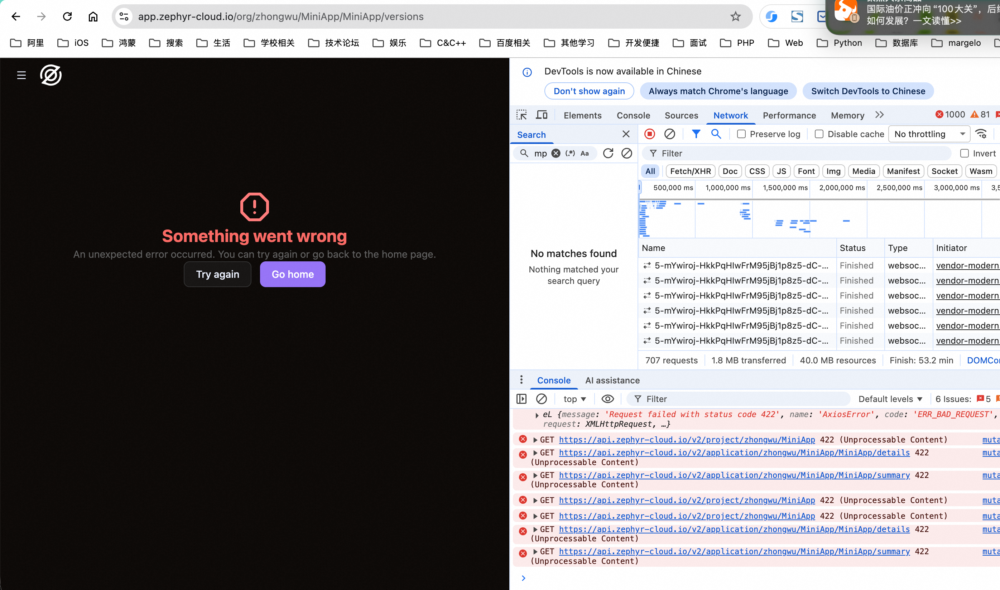

# Setup Issues - Part 2

This document records issues encountered during the setup and usage of Zephyr.

---

## 1. MODULE_NOT_FOUND Error

**Status:** ✅ Fixed by executing `yarn add zephyr-xpack-internal`

**Error Message:**
```
error Unknown error: {"code":"MODULE_NOT_FOUND","requireStack":["/Users/zhongwu/Documents/workspace/zephyr/MiniApp/node_modules/zephyr-metro-plugin/dist/lib/internal/mutate-mf-config.js","/Users/zhongwu/Documents/workspace/zephyr/MiniApp/node_modules/zephyr-metro-plugin/dist/lib/zephyr-metro-plugin.js","/Users/zhongwu/Documents/workspace/zephyr/MiniApp/node_modules/zephyr-metro-plugin/dist/lib/zephyr-metro-command-wrapper.js"]}.
Error: Unknown error: {"code":"MODULE_NOT_FOUND","requireStack":["/Users/zhongwu/Documents/workspace/zephyr/MiniApp/node_modules/zephyr-metro-plugin/dist/lib/internal/mutate-mf-config.js","/Users/zhongwu/Documents/workspace/zephyr/MiniApp/node_modules/zephyr-metro-plugin/dist/lib/zephyr-metro-plugin.js","/Users/zhongwu/Documents/workspace/zephyr/MiniApp/node_modules/zephyr-metro-plugin/dist/lib/zephyr-metro-command-wrapper.js"]}
    at /Users/zhongwu/Documents/workspace/zephyr/MiniApp/node_modules/zephyr-metro-plugin/dist/lib/zephyr-metro-command-wrapper.js:36:19
    at async Command.handleAction (/Users/zhongwu/Documents/workspace/zephyr/MiniApp/node_modules/@react-native-community/cli/build/index.js:139:9)
```

---

## 2. Documentation Issue: Metro Port Configuration Unclear

**Related Doc:** [Configure Metro for the Host](https://docs.zephyr-cloud.io/tutorials/metro#step-1-configure-metro-for-the-host)

**Issue:** The example for configuring remote address uses `localhost:8082`, but it doesn't clearly specify that the MiniApp project must be started on port 8082.

**Suggestion:** This requirement should be explicitly stated in the documentation to avoid confusion.

---

## 3. Documentation Issue: Non-Generic watchFolders Configuration

**Related Docs:**
- [Configure Metro for Module Federation](https://docs.zephyr-cloud.io/tutorials/metro#step-1-configure-metro-for-module-federation)
- [Configure Metro for the Host](https://docs.zephyr-cloud.io/tutorials/metro#step-1-configure-metro-for-the-host)

**Issue:** The `watchFolders` configuration includes hardcoded paths:

```javascript
path.resolve(__dirname, '../../node_modules'),
path.resolve(__dirname, '../../packages/core')
```

This configuration is not generic and may cause errors for users with different project structures.

**Suggestion:** The documentation should clarify that these paths need to be adjusted based on the actual project structure, or provide a more universal configuration example.

---

## 4. Configuration Issue: Unable to Configure Versions/Tags/Envs

**Status:** ❌ Error

**Screenshots:**

